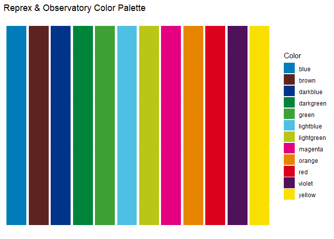

<!-- README.md is generated from README.Rmd. Please edit that file -->

# reprextemplates

<!-- badges: start -->

[](https://dataobservatory.eu/)
[](https://lifecycle.r-lib.org/articles/stages.html#experimental)
[](https://app.codecov.io/gh/dataobservatory-eu/reprextemplates?branch=main)
<!-- badges: end -->

The goal of reprextemplates is to provide reproducible visual assets for
Reprex BV and its collaboration partners.

## Installation

You can install the development version of reprextemplates from
[GitHub](https://github.com/) with:

``` r
# install.packages("devtools")
devtools::install_github("dataobservatory-eu/reprextemplates")
```

## Example

Create a Reprex color palette and add three levels of grey:

``` r
library(reprextemplates)
add_greys(pal = reprex_palette(), c(40, 60, 80))
#>       blue  lightblue  darkgreen      green        red      brown     violet 
#>  "#007CBB"  "#4EC0E4"  "#00843A"  "#3EA135"  "#DB001C"  "#5C2320"  "#4E115A" 
#>   darkblue lightgreen     yellow     orange    magenta     grey40     grey60 
#>  "#00348A"  "#BAC615"  "#FAE000"  "#E88500"  "#E4007F"  "#666666"  "#999999" 
#>     grey80 
#>  "#CCCCCC"
```

``` r
library(dplyr)
#> Warning: package 'dplyr' was built under R version 4.5.1
library(ggplot2)
#> Warning: package 'ggplot2' was built under R version 4.5.1
library(reprextemplates)

data.frame(
  Color = names(reprex_palette()),
  HEX = as.character(reprex_palette()),
  values = rep(1, 12)
) %>%
  ggplot(aes(
    x = Color,
    y = values,
    fill = Color
  )) +
  geom_col() +
  scale_fill_manual(values = reprex_palette()) +
  theme_minimal() +
  labs(y = NULL, x = NULL, title = "Reprex & Observatory Color Palette") +
  theme(
    axis.text.x = element_blank(),
    axis.ticks.x = element_blank(),
    axis.text.y = element_blank(),
    axis.ticks.y = element_blank(),
    panel.grid.major = element_blank()
  )
```



## Code of Conduct

Please note that the reprextemplates project is released with a
[Contributor Code of
Conduct](https://contributor-covenant.org/version/2/1/CODE_OF_CONDUCT.html).
By contributing to this project, you agree to abide by its terms.
